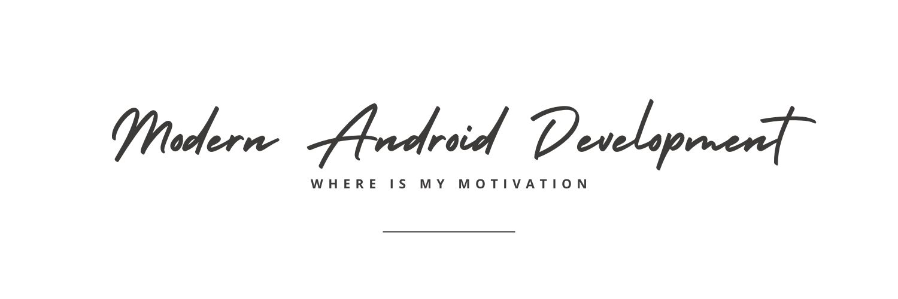

# Modern Android Development - WhereIsMyMotivation



This is a complete production ready project to learn modern Android development. It adopts the latest jetpack libraries and is based on MVVM architecture. 

Google recommendations similar design

# App Screenshots


See More Screenshots here [SCREEN_SHOTS.md](docs/SCREEN_SHOTS.md)

## Framework
- MVVM
- Material Design 3
- Navigation
- ViewModel
- Compose
- Co-Routines
- Flow
- Hilt
- Retrofit
- OkHttp
- Coil
- Room
- Firebase
- Work Manager
- Crashlytics
- Analytics
- Notifications

## Highlights
- Single Activity
- Dark and light theme
- Modular Retrofit architecture
- SharedFlow for communication
- Reusable UI components
- Notification framework
- Sharing feature
- 100% Kotlin

# About Project
WhereIsMyMotivation is a concept where you see videos and quotes that can inspire you everyday. You will get information on great personalities and make them your percieved mentors. You can also suscribe to topics of your interests. 

You can track your happiness level and write down daily journals. You can also share things of interest from web to store in your motivation box.

Using this app can bring a little bit of happiness and energy to live an inspired life.

## Instructions
```bash
# clone the backend project wimm-node-app used for this App
git clone https://github.com/janishar/wimm-node-app.git --recursive

# goto the wimm-node-app and run
npm install

# install and start docker containers (https://docs.docker.com/install)
docker-compose up -d

# clone the wimm-android-app
git clone https://github.com/janishar/wimm-android-app.git

# open wimm-android-app in Android Studio and run the app
echo "Enjoy learning Modern Android Development - WhereIsMyMotivation :D"

```

- You may want to replace the `app/src/google-services.json` with your own firebase project to see the crashlytics and test notifications. Create a firebase project from here: [Firebase](https://firebase.google.com)
- Run the Backend Project to power this App as mentioned below

## Supporting Backend Project
The backend that powers this App is also open-sourced. You can find it here: [Modern Backend Development - WhereIsMyMotivation](https://github.com/janishar/wimm-node-app)

## Find this project useful ? :heart:
* Support it by clicking the :star: button on the upper right of this page. :v:

## More on YouTube channel - Unusual Code
Subscribe to the YouTube channel `UnusualCode` for understanding the concepts used in this project:

[](https://www.youtube.com/@unusualcode)

## Contribution
Please feel free to fork it and open a PR.